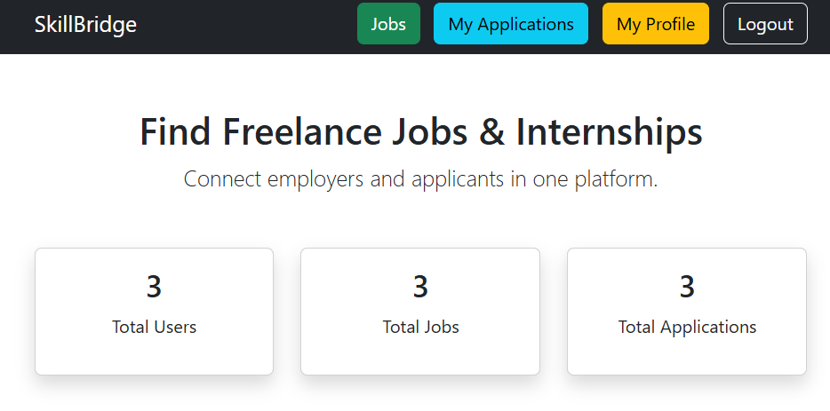
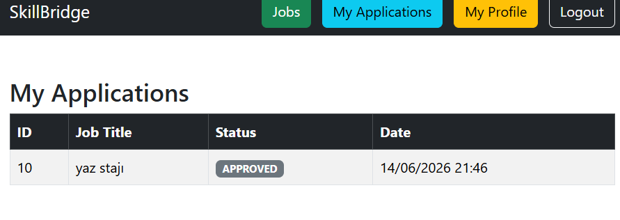
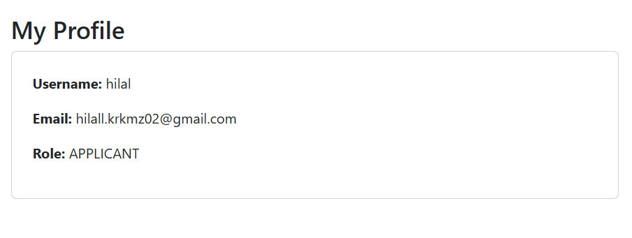
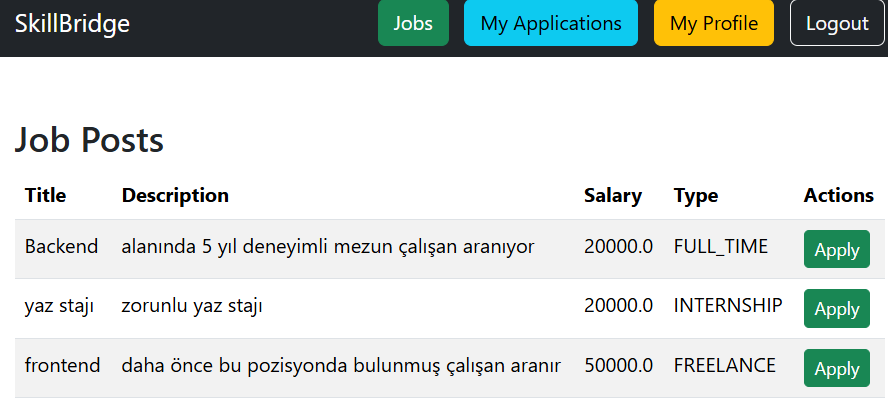

# SkillBridge

A Spring Boot web application that connects employers and job seekers for freelance jobs and internships.

## Features

- User registration and login with role-based access (EMPLOYER / APPLICANT)
- EMPLOYER: create and delete job posts, view and manage applications (approve/reject)
- APPLICANT: browse job listings, apply to jobs, track application status
- Profile page showing logged-in user info
- Form validation with error messages

## Tech Stack

- Java 17
- Spring Boot 4.1.0
- Spring Security
- Spring Data JPA / Hibernate
- PostgreSQL
- Thymeleaf
- Bootstrap 5

## Getting Started

### Prerequisites

- Java 17+
- PostgreSQL
- Maven

### Setup

1. Clone the repository:
```bash
   git clone https://github.com/your-username/skillbridge.git
   cd skillbridge
```

2. Create a PostgreSQL database:
```sql
   CREATE DATABASE skillbridge;
```

3. Update `src/main/resources/application.properties`:
```properties
   spring.datasource.url=jdbc:postgresql://localhost:5432/skillbridge
   spring.datasource.username=your_username
   spring.datasource.password=your_password
   spring.jpa.hibernate.ddl-auto=update
   spring.jpa.open-in-view=false
```

4. Run the application:
```bash
   mvn spring-boot:run
```

5. Open your browser and go to `http://localhost:8080`

## Usage

- Register as an **EMPLOYER** to post jobs and manage applications
- Register as an **APPLICANT** to browse jobs and apply
- After registering, log in and navigate using the navbar

## Screenshot







## Project Structure
src/main/java/com/example/skillbridge/

├── controller/       # MVC and REST controllers

├── entity/           # JPA entities (User, JobPost, Application, etc.)

├── repository/       # Spring Data JPA repositories

├── service/          # Service interfaces and implementations

├── security/         # Spring Security configuration

└── exception/        # Global exception handling
src/main/resources/

├── templates/        # Thymeleaf HTML templates

└── application.properties

## License

This project was developed for educational purposes.
